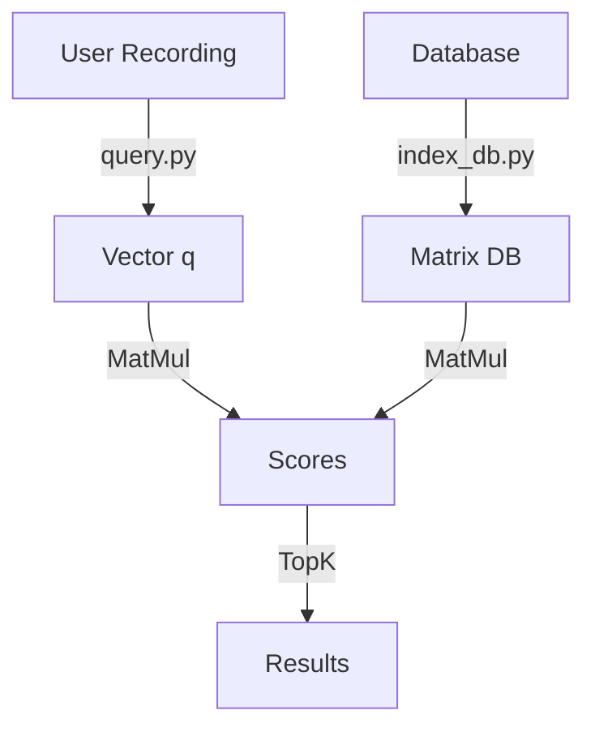

# Phase 3: The Search Engine - Masterclass Documentation

> **Goal:** Turn our trained "Brain" into a functional "Product".
> **Outcome:** A searchable Database of 8,000 songs and a Query Interface.

---

# 1. 🔍 Theory: From Training to Inference

We have spent Phase 1 & 2 in **Training Mode**.
- We wanted the model to *learn*.
- We used gradients, backpropagation, and heavy augmentations.

Now we switch to **Inference Mode**.
- We want the model to *know*.
- **Frozen Weights:** No more learning. The brain is fixed.
- **Deterministic:** No random cropping or masking. If we feed the same song twice, we MUST get the exact same vector.

### 1.1 The "Fingerprint" Analogy
We recall that our Encoder outputs a vector $z \in \mathbb{R}^{128}$ (or 512 depending on layer).
This vector is the **Digital Fingerprint** of the audio.
- It doesn't contain the *melody* note-for-note.
- It contains the *vibe*, *texture*, *genre*, and *rhythm*.

---

# 2. 🧮 Theory: Similarity Search (The "Google" Part)

So we convert 8,000 songs into 8,000 vectors. How do we search them?

### 2.1 The Nearest Neighbor Problem
Given a query vector $q$ (from your hummed recording), we want to find $d$ in our database such that:

$$ \text{maximize } \text{CosineSimilarity}(q, d) = \frac{q \cdot d}{\|q\| \|d\|} $$

Since our vectors are already normalized (length = 1), this simplifies to the **Dot Product**:
$$ q \cdot d = \sum_{i=1}^{128} q_i d_i $$

### 2.2 Scale & Complexity
- **Brute Force (Flat Index):** Compare $q$ against all 8,000 vectors.
  - Complexity: $O(N)$.
  - For $N=8,000$, this takes milliseconds. (PCs handle millions of ops/sec).
  - **Verdict:** We will use Brute Force (PyTorch Matrix Multiplication) because it's exact and easy.
- **Approximate Nearest Neighbors (ANN):** If we had 100 Million songs (Spotify scale), $O(N)$ is too slow.
  - We would use **HNSW** (Hierarchical Navigable Small World graphs) or **IVF** (Inverted File Index).
  - Tools: **FAISS** (Facebook AI Similarity Search), **ChromaDB**, **Pinecone**.
  - *We don't need these yet, but good to know they exist.*

---

# 3. 🛠️ Code Deep Dive: `src/inference.py`

This file is a "utility belt" so we don't repeat code in `index_db.py` and `query.py`.

```python
def load_trained_model(device):
    # Initializes empty model architecture
    model = EchoFindModel().to(device)
    
    # Path where we saved 'encoder.pth' in train.py
    encoder_path = os.path.join(WEIGHTS_DIR, 'encoder.pth')
    
    # Load the dictionary of numbers (weights)
    state_dict = torch.load(encoder_path, map_location=device, weights_only=True)
    
    # Inject weights into the architecture
    model.backbone.load_state_dict(state_dict)
    
    # CRITICAL: Switch to Eval mode.
    # In Train mode, Dropout randomly kills neurons (bad for inference).
    # In Train mode, BatchNorm updates stats (bad for inference).
    model.eval() 
    return model

def preprocess_for_inference(audio_path, device):
    # 1. Load Audio
    waveform, sr = torchaudio.load(audio_path)
    
    # 2. Resample (Must match training rate 22050Hz)
    if sr != SAMPLE_RATE:
        resampler = torchaudio.transforms.Resample(sr, SAMPLE_RATE)
        waveform = resampler(waveform)
        
    # 3. Deterministic "Center Crop"
    # During training, we picked RANDOM 5s chunks.
    # For inference, we want to be consistent. We pick the EXACT MIDDLE.
    current_samples = waveform.shape[1]
    if current_samples > N_SAMPLES:
        start = (current_samples - N_SAMPLES) // 2
        waveform = waveform[:, start : start + N_SAMPLES]
        
    # 5. Spectrogram (Same as training)
    spec = audio_to_melspec(waveform)
    
    # 6. Add Batch Dimension: (128, 216) -> (1, 1, 128, 216)
    return spec.unsqueeze(0).to(device)
```

---

# 4. 🗄️ Code Deep Dive: `src/index_db.py`

The "Librarian" that reads every book and writes a summary card.

```python
def build_index():
    # ... setup ...
    
    # Loop through all 8000 pre-computed spectrograms
    for file_path in tqdm(files):
        # Load the tensor from disk (Fast!)
        spec = torch.load(file_path)
        
        # Center Crop logic (Same as inference)
        # We need the stored vector to represent the "Main Theme" of the song.
        # ... logic ...
        
        # Pass through Model
        # output 'h' is the 512-dim feature vector.
        # output 'z' is the 128-dim projection (we discard z, we keep the rich h).
        h, _ = model(spec)
        
        # L2 Normalization
        # Makes the vector length = 1.
        # This makes "Angle" the only difference between vectors.
        h = F.normalize(h, p=2, dim=1)
        
        embeddings.append(h)
    
    # Save the giant matrix (8000, 512) to one file.
    db = {
        'embeddings': torch.cat(embeddings, dim=0),
        'filenames': filenames
    }
    torch.save(db, 'vector_db.pt')
```

---

# 5. 🔎 Code Deep Dive: `src/query.py`

The "Google" interface.

```python
def search(input_path, top_k=5):
    # 1. Load the Database (The Matrix)
    db = torch.load(DB_PATH)
    db_vecs = db['embeddings'] # Shape: (8000, 512)
    
    # 2. Process User's Input
    # convert mp3 -> spectrogram -> vector 'q' (1, 512)
    query_tensor = preprocess_for_inference(input_path, device)
    q, _ = model(query_tensor)
    q = F.normalize(q, p=2, dim=1)
    
    # 3. The Search (Matrix Multiplication)
    # (1, 512) @ (512, 8000) = (1, 8000)
    # This computes the dot product of 'q' against EVERY song in the DB at once.
    # GPU does this in microseconds.
    scores = torch.matmul(q, db_vecs.T).squeeze(0)
    
    # 4. Find the Winners
    # torch.topk finds the largest values in the list.
    top_scores, top_indices = torch.topk(scores, k=top_k)
    
    # 5. Print Results
    for i in range(top_k):
        print(f"{filename}: {score}")
```

---

# 6. Workflow Summary


